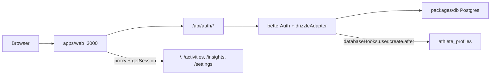

# Phase 0.2 — Authentication & account

## Decisions (locked)

- **Primary auth:** email/password (no magic link / email provider for Phase 0 founder use).
- **Auth host:** Next.js web app (`BETTER_AUTH_URL=http://localhost:3000`), not Hono. Matches [`.env.example`](.env.example) and Strava callback on `:3000`.
- **User model:** Better Auth owns `user` / `session` / `account` / `verification`. No duplicate `User` entity in `@pacepilot/core` — keep `AthleteProfile.userId` as the FK string (already stubbed).
- **Out of scope:** remaining 0.1 Vercel wiring. Local `DATABASE_URL` + first Drizzle migration are required for 0.2.

## Current baseline

Already in place:

- [`packages/core/src/entities/athlete-profile.ts`](packages/core/src/entities/athlete-profile.ts) + Drizzle [`athlete_profiles`](packages/db/src/schema/index.ts) + mapper
- Settings empty shell, app shell/nav, CORS `credentials: true` on API
- Env placeholders `BETTER_AUTH_SECRET`, `BETTER_AUTH_URL`

Missing: `better-auth` package, auth schema/migrations, handlers, UI, route protection, signup → AthleteProfile hook.

## Architecture

Hono (`:3001`) stays public for `/health` / `/sports` / Inngest in this phase. Session cookies are same-origin on `:3000`; cross-port Hono session auth is deferred until a real authenticated API surface needs it (Strava sync can stay on Next routes like the planned OAuth callback).

## Implementation

### 1. Dependencies & env

- Add `better-auth` to [`apps/web`](apps/web/package.json); wire `@pacepilot/db` into web.
- Ensure `BETTER_AUTH_SECRET` (≥32 chars) and `BETTER_AUTH_URL` / `DATABASE_URL` are documented in README + `.env.example` (already partially there).

### 2. Auth config + schema

- Create [`apps/web/lib/auth.ts`](apps/web/lib/auth.ts):
  - `betterAuth({ database: drizzleAdapter(db, { provider: "pg", schema }), emailAndPassword: { enabled: true }, plugins: [nextCookies()] })`
  - `databaseHooks.user.create.after`: insert `athlete_profiles` row (`displayName` from `user.name`, defaults timezone `UTC`, units `metric`)
- Create [`apps/web/lib/auth-client.ts`](apps/web/lib/auth-client.ts) with `createAuthClient` from `better-auth/react`.
- Mount handler at [`apps/web/app/api/auth/[...all]/route.ts`](apps/web/app/api/auth/[...all]/route.ts) via `toNextJsHandler(auth)`.
- Generate Better Auth Drizzle tables into [`packages/db/src/schema`](packages/db/src/schema) (`npx auth@latest generate` / equivalent), export them from schema index, then **first** `drizzle-kit generate` + migrate (auth tables + existing domain tables). Optionally add FK from `athlete_profiles.user_id` → `user.id` once auth `user` exists.

### 3. Route groups, UI, protection

Restructure web routes lightly:

- `(auth)/sign-in`, `(auth)/sign-up` — minimal layout (no app nav)
- `(app)/` — existing dashboard pages under current `AppShell`

UI (shadcn from `@workspace/ui`):

- Sign up / sign in forms (email, password, name on signup)
- Sign out in header or settings
- Settings: show email + editable display name (updates `athlete_profiles` + optionally Better Auth `user.name`); soft-delete stub sets `deletedAt` and signs out (full wipe stays 0.8)

**Protection (Next 16):** add [`apps/web/proxy.ts`](apps/web/proxy.ts) (not `middleware.ts` — Next 16 rename). Optimistic cookie check via `getSessionCookie` for redirects; real `auth.api.getSession` in a shared `(app)` layout / server helpers so acceptance criteria hold. Public matchers: `/sign-in`, `/sign-up`, `/api/auth/*`.

### 4. Soft delete / account deletion stub

- Server action or route: set `athlete_profiles.deletedAt = now()`, sign out.
- Do not hard-delete Better Auth user or cascade activities yet (0.8).

### 5. Docs & roadmap checklist

- README: auth setup steps (secret, migrate, sign-up flow).
- Mark 0.2 items done in [`ROADMAP.md`](ROADMAP.md); note AthleteProfile domain/DB already existed before this phase.

### 6. Test & validate (required before calling 0.2 done)

Do not mark 0.2 complete until the checks below pass against a running local app + migrated DB.

**Static / compile**

- `pnpm` typecheck + lint for touched packages (`web`, `db`, `core` if changed).

**Manual smoke (quick)**

- Sign up → land on dashboard → hard refresh still authenticated.
- Sign out → `/` redirects to `/sign-in`.
- Settings shows email + display name; soft-delete stub signs out.

**Automated browser validation (Playwright)**

Use the repo skill [`.agents/skills/webapp-testing/SKILL.md`](.agents/skills/webapp-testing/SKILL.md) during implementation — Python Playwright scripts + `scripts/with_server.py` when useful.

Prerequisites to install if missing (one-time during this phase):

- Python Playwright: `pip install playwright` then `playwright install chromium`
- Optional: project-level `@playwright/test` only if we want a checked-in JS e2e suite later; **default for 0.2 is skill-driven Python scripts** (no permanent e2e harness required unless we decide to keep one under e.g. `apps/web/scripts/` or `scripts/auth-smoke.py`).

Flow to automate (headless Chromium):

1. Unauthenticated `GET /` → redirected to `/sign-in`
2. Sign up with unique email/password/name → dashboard reachable
3. Hard reload → still authenticated (session cookie)
4. Open `/settings` → email visible; update display name persists after reload
5. Soft-delete stub → signed out; dashboard redirect works again
6. Sign in with same credentials still works for Phase 0 stub (user row remains; athlete soft-deleted — document expected behavior if soft-deleted athletes are blocked or allowed to re-create profile)

Also verify in DB (SQL or Drizzle studio): `user` row + matching `athlete_profiles.user_id` after signup.

## Acceptance criteria mapping

| Criterion | How we verify |
| --- | --- |
| Create account + stay signed in across refresh | Playwright: sign up → reload → session still present; DB has user + athlete |
| Unauthenticated users cannot access dashboard | Playwright: logged-out `/` → `/sign-in` |
| Account settings shell usable | Settings shows email/display name; update + soft-delete stub exercised |

## Explicitly not in this plan

- Magic link / OAuth social
- Vercel preview + non-prod deploy wiring (leftover 0.1)
- Strava (0.3)
- Hono session middleware across ports
- Permanent CI e2e pipeline (optional follow-up; local Playwright validation is enough for 0.2)
