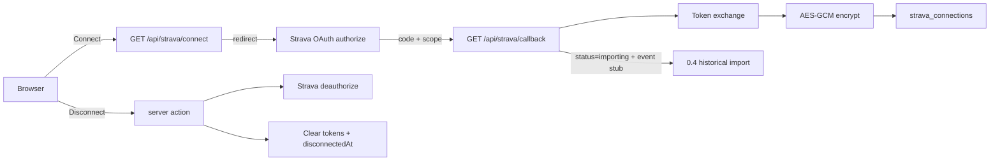

# Phase 0.3 — Strava connection

## Decisions (locked)

- **OAuth host:** Next.js web (`STRAVA_REDIRECT_URI=http://localhost:3000/api/strava/callback`), same as 0.2 auth host. Not Hono.
- **Scopes:** `read,activity:read_all,profile:read_all` — enough for private activities + athlete profile; no write scopes.
- **Token encryption:** AES-256-GCM with `TOKEN_ENCRYPTION_KEY` (32-byte key, base64). Ciphertext format `iv:authTag:ciphertext` (base64 segments). Never log plaintext tokens; never return encrypted or plaintext tokens to the client.
- **Client DTO:** `StravaConnectionStatus` exposes connected flag, athlete id, sync status, scopes, timestamps, lastError — **no** token fields.
- **Disconnect:** Call Strava deauthorize when possible; clear encrypted tokens locally; set `disconnectedAt`; keep previously imported activities (full wipe stays 0.8 / account deletion). Document in README.
- **Import trigger:** On successful connect, set `syncStatus` to `importing` and emit Inngest event `strava/import.historical` when Inngest is configured; handler implementation is **0.4**. Status may stay `importing` until 0.4 lands.
- **Strava app credentials:** Founder creates the Strava API application manually; code + docs assume env vars are set. Local callback domain `localhost` is allowed by Strava.
- **Adapter location:** `apps/web/lib/strava/*` + `apps/web/lib/crypto/*` for Phase 0 (web owns OAuth). Extract to a shared package when `apps/api` Inngest workers need the same client in 0.4+.

## Current baseline

Already in place:

- Domain [`StravaConnection`](packages/core/src/entities/strava-connection.ts) + Drizzle [`strava_connections`](packages/db/src/schema/index.ts) + [`toStravaConnection`](packages/db/src/mappers.ts)
- Env placeholders in [`.env.example`](.env.example) + Turbo `globalPassThroughEnv`
- Auth session helpers; Settings account UI; dashboard empty “Connect Strava (soon)”

Missing: OAuth routes, encryption, refresh/deauthorize, connection service, live Connect/Disconnect UI, rate-limit helpers, docs/checklist.

## Architecture

## Implementation

### 1. Token encryption

- `apps/web/lib/crypto/token-encryption.ts` — `encryptToken` / `decryptToken`
- Require `TOKEN_ENCRYPTION_KEY` (base64, 32 bytes). Fail closed if missing when encrypting/decrypting.
- Unit tests with known plaintext round-trip + tamper detection.

### 2. Strava OAuth + rate limits

- `apps/web/lib/strava/config.ts` — read `STRAVA_CLIENT_ID` / `SECRET` / `REDIRECT_URI`
- `apps/web/lib/strava/oauth.ts` — `buildAuthorizeUrl`, `exchangeAuthorizationCode`, `refreshAccessToken`, `deauthorize`
- Endpoints (per Strava docs):
  - Authorize: `https://www.strava.com/oauth/authorize`
  - Token: `POST https://www.strava.com/api/v3/oauth/token`
  - Deauthorize: `POST https://www.strava.com/oauth/deauthorize`
- `apps/web/lib/strava/rate-limit.ts` — parse `X-RateLimit-*` / `X-ReadRateLimit-*`; `shouldThrottle` when usage ≥ 90% of either window.
- Inject `fetch` for tests.

### 3. Connection service

- Resolve athlete via session → `athlete_profiles`
- `getConnectionStatus(athleteId)` → client-safe DTO (active = `disconnectedAt == null`)
- `completeOAuthConnection({ athleteId, code, scope })` — exchange, encrypt, upsert by `athleteId` (reconnect clears `disconnectedAt`)
- `disconnectConnection(athleteId)` — decrypt access token, deauthorize (best-effort), blank tokens / set disconnected
- `getValidAccessToken(athleteId)` — refresh if `expiresAt` within 5 minutes; persist rotated refresh token
- Never include tokens in thrown error messages

### 4. Routes + UI

- `GET /api/strava/connect` — require session; CSRF `state` cookie (httpOnly); redirect to Strava
- `GET /api/strava/callback` — validate state; exchange; store; redirect `/settings?strava=connected` or `?strava=error`
- Server action `disconnectStrava`
- Settings: `StravaConnectionCard` (Connect / Connected status / Disconnect)
- Dashboard empty state: real Connect link when disconnected
- Proxy: `/api/strava/*` already excluded via `api` matcher skip

### 5. Docs & roadmap

- README: create Strava API app, callback URLs, scopes, `TOKEN_ENCRYPTION_KEY` generation, disconnect keeps activities
- Mark 0.3 implement/acceptance items in `ROADMAP.md`

### 6. Validation

**Unit (vitest in `apps/web`):** encryption, authorize URL, rate-limit parser, OAuth exchange with mocked fetch, status DTO excludes tokens.

**Playwright:** authenticated Settings shows Connect; Connect href hits `/api/strava/connect` (may 302 to Strava or error without credentials — assert redirect target shape when env present, otherwise assert button/link exists). Seeded connection (test helper or mocked status) shows Disconnect and no token strings in HTML.

## Acceptance criteria mapping

| Criterion | How we verify |
| --- | --- |
| Founder connects personal Strava | Manual with real credentials; automated: OAuth URL + callback path with mocked token exchange |
| Tokens never in logs or client responses | Unit: status DTO shape; Playwright: page content has no `access_token` / encrypted blobs; code review of logging |
| Disconnect removes auth + updates UI | Unit/service test + Playwright disconnect → Connect CTA returns |

## Explicitly not in this plan

- Historical import / activity sync jobs (0.4)
- Webhooks (0.4)
- Vercel preview Strava callback domain wiring beyond docs
- Extracting Strava client to a shared package
