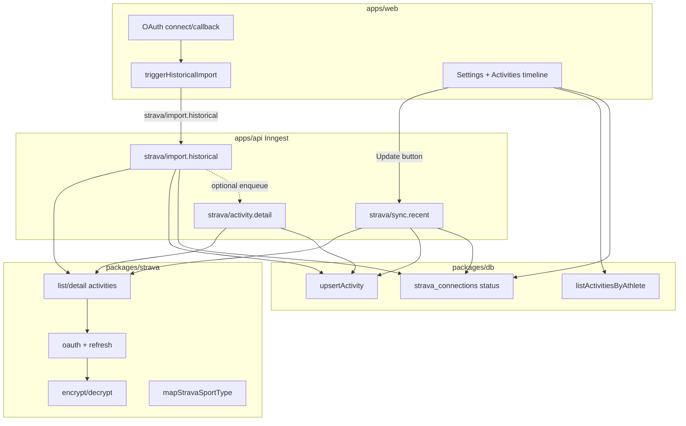

# Phase 0.4 — Activity sync & normalization

## Outcomes

Historical import + ongoing sync produce a reliable unified activity timeline the founder can browse across sports.

## Decisions (locked)

### Shared Strava package (required by 0.3)

- **Create `packages/strava` (`@pacepilot/strava`)** — framework-agnostic Strava HTTP adapter + token crypto.
- **Move from `apps/web` into the package:**
  - Token encrypt/decrypt (`TOKEN_ENCRYPTION_KEY`, AES-256-GCM)
  - OAuth helpers (exchange, refresh, deauthorize, authorize URL builder)
  - Rate-limit parsing / throttle helpers
- **Add in the package:**
  - `listAthleteActivities` (paginated `GET /api/v3/athlete/activities`)
  - `getActivity` (detail `GET /api/v3/activities/{id}`)
  - Strava summary/detail DTO types (narrow, not full Strava OpenAPI dump)
  - `mapStravaSportType(sportType | type) → Sport` (core sport enum)
- **Stay in `apps/web`:** OAuth routes (`/api/strava/connect|callback`), CSRF state cookie, connection persist/disconnect UI actions, `triggerHistoricalImport` emitter.
- **Stay in / land in `apps/api`:** Inngest handlers that call shared Strava client + `@pacepilot/db` upserts.
- **Token refresh for workers:** shared helper `getValidAccessToken(athleteId, db)` (or connection-service module used by api) — decrypt → refresh if near expiry → re-encrypt rotated refresh token. Reuse 0.3 5-minute skew. Never log tokens.

### Event naming (canonical = already emitted)

Keep **slash** names (Inngest convention + existing emitter). Update ROADMAP dots → slash when documenting.

| Event | Purpose |
| --- | --- |
| `strava/import.historical` | Full paginated backfill after connect (already emitted) |
| `strava/sync.recent` | Incremental catch-up — **only when user clicks Update** |
| `strava/activity.detail` | Fetch detail when list payload is insufficient or after create/update |

### Ongoing sync: on-demand Update (no background poll)

- **Phase 0:** no scheduled cron / no always-on poll. Sync runs when the user clicks **Update** (Settings and/or Activities).
- **Update button** → server action sets a short-lived syncing state (reuse `importing` or a clear `syncing` UX on the card) and emits `strava/sync.recent` for that athlete’s active connection.
- **`strava/sync.recent`:** fetch recent pages since `lastSyncAt` (or a small day buffer); upsert; bump `lastSyncAt`; return to `synced` / `error`.
- **Historical import** still auto-triggers once on connect (`strava/import.historical`); afterward, refreshes are explicit.
- **SLA:** new Strava activity appears in PacePilot **after the user clicks Update** (no background freshness guarantee). Document that clearly in README/UI copy.
- **Webhook subscription:** explicitly deferred (needs stable public URL; revisit when Vercel preview/prod is wired). Do not block 0.4 on webhooks.
- **Later:** scheduled poll or webhooks can return when multi-user / “always fresh” is needed — not Phase 0.

### Activity identity & fields

- **Keep domain field `externalId`** (already shipped). PRD/ROADMAP `sourceActivityId` = same concept; document the alias once in core JSDoc / ROADMAP — do not rename columns in 0.4.
- **Idempotency key:** unique constraint on `(athlete_id, source, external_id)`. Upsert on conflict update mutable fields + `rawData` + `updatedAt`.
- **Extend `Activity` (core + db) in 0.4:**
  - `calories: number | null`
  - `averageSpeedMetersPerSecond: number | null`
  - `maxSpeedMetersPerSecond: number | null`
  - `rawData: unknown` (persist as `jsonb`) — store Strava summary (and detail when fetched) for reprocess without re-fetch
  - `metricsVersion: string` — start at `"activity.v1"`; bump when normalization rules change
- **Keep existing:** `name`, `averagePaceSecondsPerKm` (derived for distance sports when possible).
- **Sport-specific types in core (thin for 0.4):**
  - `RunningMetrics`, `PadelMetrics`, `SwimmingMetrics` as TypeScript interfaces / helpers derived from `Activity` + `rawData`
  - Full cadence/GAP extraction only when present in payload; deep metrics engine stays **0.5**
- **Sport mapping (minimum):** map common Strava `sport_type` / `type` strings → `SPORTS`. Unknown → `other`. Document padel heuristics (e.g. `Workout` + name keywords, or `RockClimbing`-style quirks) in a short validation notes comment/README; refine in dogfooding.

### Import progress model

- Extend **client-safe** connection status (not tokens) with:
  - `importedCount: number` (count of activities for athlete, or counter updated per page)
  - optional `importCursor` / `lastImportedAt` for debugging (cursor can stay server-only if preferred)
- Historical job updates `syncStatus`: `importing` → `synced` | `error`; sets `lastSyncAt` / `lastError`.
- UI polls status (Settings card + dashboard) during `importing`; no separate websocket required.

### Detail fetch policy

- Historical import uses **list endpoint** pages first (fast, rate-limit friendly).
- Enqueue `strava/activity.detail` when list row is missing fields we care about for timeline/metrics v1 (e.g. null HR when `has_heartrate`, or sport needs richer payload) — **or** always detail for the first page only if rate limits allow during founder dogfood.
- Prefer: **list always; detail on demand / selective** to stay under Strava 15-min / daily read limits. Respect `shouldThrottleStrava`; Inngest step sleep/retry on throttle.

### Explicitly deferred from 0.4

- Strava webhooks
- Background / cron polling for recent activities
- Vercel preview Strava callback / deploy wiring (0.1 leftover — parallel)
- Metrics engine volume/load/PRs (0.5)
- Rich dashboard charts / weekly summaries (0.6)
- Shared package beyond Strava (no generic “integrations” mega-package yet)
- Streams / maps / segment effort UI

---

## Current baseline

Already in place:

- Core [`Activity`](packages/core/src/entities/activity.ts) stub + [`SPORTS`](packages/core/src/value-objects/sport.ts) + pace VO
- DB [`activities`](packages/db/src/schema/index.ts) + [`strava_connections`](packages/db/src/schema/index.ts) + `toActivity` mapper — **no unique on (source, external_id)**
- Web Strava OAuth (0.3): connect/callback, encrypted tokens, `getValidAccessToken`, disconnect
- [`triggerHistoricalImport`](apps/web/lib/strava/import-trigger.ts) emits `strava/import.historical` when `INNGEST_EVENT_KEY` set; sets `syncStatus=importing`
- Inngest scaffold in [`apps/api/src/jobs/inngest.ts`](apps/api/src/jobs/inngest.ts) — only `helloJob`
- UI: Settings sync badge + dashboard “Waiting for activity import”; [`/activities`](apps/web/app/(app)/activities/page.tsx) empty stub

Missing: shared package extract, activities HTTP client, Inngest handlers, upsert uniqueness, sport mapper, rawData/metricsVersion, timeline UI, progress/retry, on-demand Update → `strava/sync.recent`.

---

## Architecture

---

## Implementation

### 1. `packages/strava` extract + activities client

- Scaffold package (tsconfig, exports, vitest) matching monorepo conventions.
- Move web crypto + oauth + rate-limit; update `apps/web` imports; keep route handlers thin.
- Implement paginated list + detail with injectable `fetch`; parse rate-limit headers on every response.
- Unit tests: sport map table, pagination query params (`page`, `per_page`), throttle behavior, token round-trip (moved tests).

### 2. Activity model + migration

- Extend core `Activity` interface + JSDoc alias for `sourceActivityId`.
- Add sport-specific metric interfaces (derived helpers OK; no React).
- Drizzle: new columns + `uniqueIndex` on `(athlete_id, source, external_id)`; generate migration.
- Mapper: row ↔ domain including `rawData` / `metricsVersion`.
- Repository helpers in `packages/db` (or api service using drizzle): `upsertActivity`, `listActivitiesForAthlete({ athleteId, limit, cursor? })`, `countActivitiesForAthlete`.

### 3. Inngest jobs (`apps/api`)

**`strava/import.historical`**

1. Load connection by `athleteId` / `connectionId`; abort if disconnected.
2. Resolve valid access token (shared helper).
3. Paginate list (`per_page=200`) in Inngest `step`s; upsert each page; update imported count / status.
4. On completion → `syncStatus=synced`, `lastSyncAt=now`, clear `lastError`.
5. On failure → `syncStatus=error`, set `lastError` (no tokens in message); allow UI retry to re-emit event.

**`strava/activity.detail`**

- Input: `{ athleteId, externalId }`; fetch detail; merge into upsert (`rawData`, richer fields).

**`strava/sync.recent`**

- Triggered **only** by Update (or retry) — no cron registration.
- Event data: `{ athleteId, connectionId }` for the current user only.
- Fetch recent pages since `lastSyncAt` (or a small day buffer); upsert; bump `lastSyncAt`.
- Do not re-run full history unless user chooses Retry historical import.

Wire functions into `functions` array + Inngest serve route (already at `/api/inngest`).

### 4. Import UX

- **Settings `StravaConnectionCard`:** show imported count while `importing`; replace “jobs land in 0.4” copy; **Update** when `synced` (emit `strava/sync.recent`); **Retry import** when `error` (historical or recent, based on last failure).
- **Dashboard / Activities:** same **Update** affordance when connected; show `lastSyncAt` so freshness is obvious.
- **`/activities`:** chronological timeline (newest first) — sport badge, name, date, duration, distance/pace when present; empty state before first sync; error banner with retry if connection errored.
- Prefer server components + lightweight poll/refresh **only while a job is in flight** (`importing`) — not background activity polling. Keep bundle small.

### 5. Docs & roadmap

- README: local Inngest (`inngest-cli` / `pnpm` script), required keys, on-demand Update (no background poll), how reconnect / retry works.
- ROADMAP: check off 0.4 items as implemented; note ongoing sync = manual Update for Phase 0; fix event name notation; mark founder Strava app setup done under 0.3; update status line (“0.3 done; 0.4 in progress”).
- Note webhook + scheduled poll deferred.

### 6. Validation

**Unit**

- Sport mapping matrix (Run, TrailRun, Ride, Swim, WeightTraining, Walk, Hike, unknown → other; padel heuristic cases).
- Upsert idempotency (insert then update same external id → one row).
- Normalization from fixture Strava JSON → `Activity` (`metricsVersion`, pace derivation).
- Rate-limit throttle still covered in shared package.

**Integration / e2e**

- Mocked Strava fetch + Inngest step function test (or handler unit with fake steps) for one historical page.
- Playwright: connected user with seeded activities sees timeline rows; importing/error UI states with seeded connection status; still no tokens in HTML.

**Manual (founder)**

- Connect (already done) → run import → spot-check 10+ activities vs Strava (distance, duration, sport).
- Create a new Strava activity → click **Update** → confirm it appears on the timeline.

---

## Acceptance criteria mapping

| Criterion | How we verify |
| --- | --- |
| Full personal history imports without silent drops | Paginated import until empty page; founder spot-check; log page counts |
| Re-running import does not duplicate | Unique `(athlete_id, source, external_id)` + upsert tests |
| Timeline shows activities across multiple sports | `/activities` list with sport badges; multi-sport fixture/e2e |
| New activity within acceptable window | Phase 0: after **Update** click; document no background freshness SLA |

---

## Suggested build order

1. Lock decisions (this plan) → extract `packages/strava` + migrate web
2. Activity schema migration + upsert repo
3. Historical import job + status transitions
4. Activities timeline + progress/retry + **Update** UX
5. On-demand `strava/sync.recent` + selective detail job
6. Docs / ROADMAP / validation pass

---

## Open questions (resolve before coding if opinionated)

None blocking if the locked decisions above are accepted. Optional tweaks only:

1. Package name: `@pacepilot/strava` vs `@pacepilot/integrations-strava` — default **`@pacepilot/strava`**.
2. Detail aggressiveness: selective vs always-detail-first-page — default **selective**.
3. Progress count source: live `count(*)` vs incremental counter on connection — default **`count(*)` for UI** (simpler, accurate enough).
4. Update button placement: Settings only vs Settings + Activities — default **both** (same server action).
