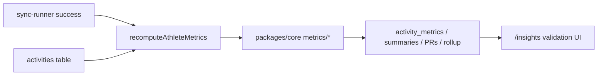

# Phase 0.5 — Metrics engine (deterministic)

## Outcomes

Algorithms calculate **volume, frequency, intensity, load, PRs, and simple trends** from already-synced activities. Numbers are transparent, versioned, and recomputable — **no AI**. Founder can spot-check totals against Strava before 0.6 dashboard polish.

## Boundary vs neighbors

| Phase | Owns |
| --- | --- |
| **0.4 (done)** | Import + Activity timeline + Update sync |
| **0.5 (this)** | Pure metrics + persistence + recompute + thin Insights validation |
| **0.6 (next)** | “Good morning” dashboard, filters, activity detail, weekly/monthly pages, insight **cards** |
| **0.7** | Privacy / delete (token encrypt + disconnect already exist) |

Do **not** build in 0.5: dashboard chart polish, activity detail page, weekly/monthly summary **pages**, LLM copy, goals UI, webhooks.

---

## Decisions (locked)

### 1. Where algorithms live

- **`packages/core/src/metrics/`** — pure, framework-free functions + domain types.
- **Not** a new `packages/metrics` package yet (avoid speculative package until size warrants).
- **Not** in `apps/web` or Strava adapter — adapters stay I/O only.
- Persistence + “recompute for athlete” orchestration in `packages/db` helpers + a small runner called from web sync (same pattern as 0.4 Next.js sync).

### 2. Persist vs compute-on-read

- **Persist derived rows**, recompute after sync.
  - Per activity → `activity_metrics` (intensity, session load, flags)
  - Per period → `training_summaries` (week / month keys)
  - `personal_records` rows (one per athlete + sport + record kind)
  - Athlete **rollup snapshot** on `athlete_profiles` (or `athlete_metric_rollups` JSON) for dashboard-ready fields
- Rationale: 0.6 needs fast reads; recompute-from-`rawData` stays possible via version bump.
- On-read-only aggregation is OK as a fallback for week-to-date if a summary row is stale mid-week — primary path still persisted.

### 3. Volume model (`volume.v1`)

Distinguish **sport volume** vs **total training exposure** (PRD §13):

| Sport class | Primary volume unit | Also always store |
| --- | --- | --- |
| Distance sports (`running`, `cycling`, `swimming`, `walking`, `hiking`) | meters (display km/mi later) | duration seconds |
| Duration sports (`padel`, `strength`, `other`) | duration seconds | distance if present (usually null) |

Period totals:

- `bySport[]`: `{ sport, sessionCount, distanceMeters, durationSeconds }`
- `totalDurationSeconds` — **total training exposure**
- `totalDistanceMeters` — sum of distance sports only (null distance excluded)

Windows: **ISO week (athlete timezone)** and **calendar month**. Daily series optional as array on week summary or skip until 0.6 charts.

### 4. Intensity (`intensity.v1`)

Labels: `easy` | `moderate` | `hard` | `unknown`

**Priority of signals (first match wins):**

1. **HR** if `averageHeartRate` present:
   - **`hrMax` = rolling 90-day max of activity `maxHeartRate`** (among activities with HR). If none in window, fall back to current activity’s `maxHeartRate`, then documented constant `190` only as last resort.
   - `%HRmax = avgHR / hrMax`
   - Easy `< 70%`, Moderate `70–84%`, Hard `≥ 85%` (classic zones — document in methodology)
   - No profile `maxHeartRate` field in 0.5.
2. Else **pace proxy** for running/cycling/swimming when pace/speed exists: compare to athlete’s rolling 28-day median pace for that sport (± thresholds TBD in implementation notes; unit-tested).
3. Else if Strava `suffer_score` / `perceived_exertion` in `rawData` — map to bands (document).
4. Else **`unknown`** (not silent `moderate`) so UI can say “insufficient data”.

Version string on each metric row: `intensity.v1`.

### 5. Training load (`load.v1`)

Transparent TRIMP-style proxy (not Banister/CTL yet):

```text
sessionLoad = (durationMinutes) × intensityFactor × sportFactor
```

- `intensityFactor`: easy `1.0`, moderate `1.5`, hard `2.5`, unknown `1.2`
- `sportFactor`: running `1.0`, cycling `0.9`, swimming `1.1`, padel `1.2`, strength `0.8`, walking/hiking `0.7`, other `1.0`

Disclaimer (UI + README): **not a medical measurement**; internal PacePilot load only.

Version: `load.v1`. Sum session loads for week/month summaries. High-intensity cluster = ≥3 `hard` sessions in any rolling 7 local days (or ≥2 consecutive calendar days with a hard session — pick one rule and test it).

### 6. Frequency & consistency

- Sessions/week (completed activities in ISO week)
- Streak: consecutive local days with ≥1 activity (break on empty day)
- Consistency score `0–100`: for last 4 complete weeks, `100 * (weeks_with_≥3_sessions / 4)` as v1 placeholder — document; refine in dogfood

### 7. Trends (placeholders only)

Simple moving windows — **not** physiology models:

- `fitnessTrend`: 4-week rolling average of weekly load (direction: up/flat/down vs prior 4 weeks)
- `recoveryTrend`: inverse of hard-session density last 7 vs prior 7 (placeholder)
- `performanceTrend`: running-only median pace last 28d vs prior 28d when enough runs; else `unknown`

Store as enum/direction + numeric delta on rollup — enough for 0.6 cards later.

### 8. Personal records

| Sport | Kinds |
| --- | --- |
| Running | `fastest_1k`, `fastest_5k`, `fastest_10k`, `longest_distance` |
| Cycling | `fastest_ride` (best avg speed with min distance threshold), `longest_distance` |
| Swimming | `longest_distance`, `fastest_distance` (best pace with min distance) |
| Padel | `longest_duration`, `highest_avg_hr`, `highest_session_load` |

**Distance PR approach (locked):** estimate from what we have — no streams required in 0.5.

- Prefer detail/`rawData` splits if present
- Else **estimate** when `distanceMeters ≥ target` using average pace (`estimated: true` on PR)
- Never invent splits for activities shorter than the target
- Document estimation as a known validation risk in methodology / validation-notes

### 9. Recompute trigger (locked)

After `runHistoricalImport` / `runRecentSync` succeeds:

1. Load activities for the chosen scope
2. Upsert `activity_metrics` per activity
3. Rebuild affected ISO week and month summaries
4. Recompute PRs (all-time scan when scope is full; otherwise refresh from activities in scope + existing PR table)
5. Write athlete rollup snapshot
6. Set `athlete_profiles.metricsComputedAt` / `metricsVersion` (`metrics.bundle.v1`)

**Scope (locked — not “last 90 days only”):**

| Mode | When | Behavior |
| --- | --- | --- |
| **Incremental** | After Update / recent sync | Recompute metrics for activities touched since last sync (plus rebuild current week/month summaries). Still refresh PRs against candidates in that set. |
| **Full** | After historical import success; Insights/Settings **“Recompute all metrics”** action | Scan **all** activities for the athlete — intensity/load, all week/month summaries needed, all-time PRs, rollup. |

Founder must always be able to force **full** recompute without re-importing Strava.

Keep sync path Next.js (no Inngest) — same as 0.4.

### 10. Thin Insights UI (locked — ship in 0.5)

`/insights` currently stub → show:

- This week: by-sport volume + total duration + session count
- Intensity mix (easy/moderate/hard/unknown counts)
- Week load + cluster warning if any
- Top PRs list (mark estimated PRs)
- Methodology version strings + medical disclaimer
- **Recompute all metrics** control
- Note: full dashboard is 0.6

No chart library requirement; simple lists/badges matching existing UI.

---

## Current baseline

Already in place:

- Synced `Activity` rows with distance, duration, HR, pace, calories, speeds, `rawData`, `metricsVersion = activity.v1`
- Thin `RunningMetrics` / `PadelMetrics` / `SwimmingMetrics` helpers
- `AthleteProfile` identity only (no rollups)
- Timeline on `/activities`; Update sync working
- Insights page stub

Missing: all 0.5 calculation entities, DB tables, recompute, Insights numbers.

---

## Architecture



---

## Implementation

### 1. Core types + enums

- `IntensityLabel`, `TrendDirection`
- `ActivityMetric` — activityId, intensity, intensityVersion, sessionLoad, loadVersion, flags
- `TrainingSummary` — athleteId, period (`week`|`month`), periodStart, totals, bySport, intensityCounts, highIntensityCluster
- `PersonalRecord` — athleteId, sport, kind, activityId, value, unit, estimated, achievedAt
- Extend `AthleteProfile` (or separate `AthleteMetricRollup` type) with rollup fields from ROADMAP

### 2. Pure algorithms + tests

- `classifyIntensity(activity, context) → IntensityLabel`
- `computeSessionLoad(activity, intensity) → number`
- `aggregateVolume(activities, range, timezone)`
- `computeFrequencyConsistency(...)`
- `detectPersonalRecords(activities)`
- `computeTrendPlaceholders(...)`
- Unit tests with fixtures (easy jog, hard interval, padel with HR, strength no HR → unknown)

### 3. DB schema + repo

- Tables + migrations
- `upsertActivityMetric`, `upsertTrainingSummary`, `upsertPersonalRecord`, `getInsightsBundle(athleteId)`
- Unique keys: `(activity_id)` for metrics; `(athlete_id, period, period_start)` for summaries; `(athlete_id, sport, kind)` for PRs

### 4. Wire recompute

- `apps/web/lib/metrics/recompute.ts` (or under `packages/db`)
- After recent sync → **incremental**; after historical import → **full**
- Insights/Settings server action: **Recompute all metrics** (full)

### 5. Insights validation UI + docs

- Populate `/insights` (required in 0.5)
- `docs/metrics-methodology.md` (or README section): intensity.v1, load.v1, volume rules, estimated PRs, disclaimer
- `docs/validation-notes.md` empty template for misleading metrics during dogfood
- ROADMAP 0.5 checkboxes + status line

### 6. Validation

**Automated:** intensity/load/volume/PR unit tests; timezone week boundary test; estimated PR flags.

**Manual (founder):**

- Spot-check 20+ activities distance/duration/HR vs Strava
- This-week km + padel hours vs mental math
- Known easy/hard runs get sane labels
- Log misses in validation-notes

---

## Acceptance criteria mapping

| ROADMAP criterion | How we verify |
| --- | --- |
| Spot-check 20+ vs Strava | Founder checklist + Insights/timeline |
| Weekly totals within tolerance | Insights week card vs Strava week |
| Intensity labels feel sane | Known sessions + unit fixtures |
| Misleading metrics logged | `docs/validation-notes.md` started |

---

## Suggested build order

1. ~~Lock decisions~~ ✅
2. Core types + pure algorithms + unit tests (TDD-friendly)
3. DB schema + repos
4. Incremental + full recompute paths + manual full recompute action
5. Insights validation UI (incl. Recompute all)
6. Docs / ROADMAP / founder spot-check

---

## Locked answers (founder)

1. **HR max:** rolling 90-day max (fallback chain only if window empty).
2. **Running distance PRs:** estimate from available distance + avg pace; mark `estimated`.
3. **Recompute:** incremental after Update; **full** after historical import and via explicit “Recompute all metrics” — not capped to last 90 days.
4. **Insights:** ship thin validation UI in 0.5.

Ready to implement when you say go.
