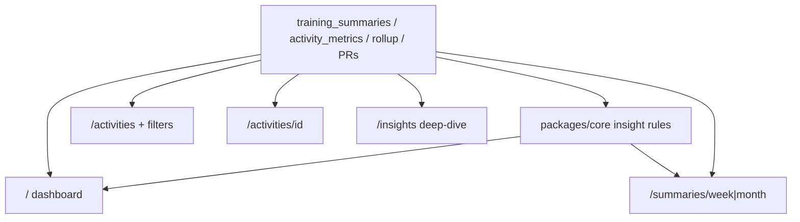

# Phase 0.6 — Athlete dashboard & timeline (no AI)

## Outcomes

Home answers **“How am I doing?”** from deterministic 0.5 metrics. Founder can understand the week without opening Strava. Cross-sport load is visibly more informative than single-sport Strava charts.

## Boundary vs neighbors

| Phase | Owns |
| --- | --- |
| **0.5 (done)** | Algorithms, persistence, recompute, thin Insights validation |
| **0.6 (this)** | Dashboard UX, insight **cards**, filters, activity detail, week/month pages, sport slices |
| **0.7** | Privacy / delete (encrypt + disconnect already exist) |
| **2.x** | LLM “Ask My Data” / AI reports |

Do **not** build in 0.6: AI copy, goals UI polish, charts library sprawl, webhooks, coach features, fake padel match scores.

---

## Decisions (locked)

### 1. Information architecture

| Route | Role after 0.6 |
| --- | --- |
| `/` (Dashboard) | Primary “Good morning” — week snapshot + insight cards + recent activities teaser + Update |
| `/activities` | Full timeline + filters |
| `/activities/[id]` | Activity detail (core + intensity/load + sport fields) + Strava deep link |
| `/insights` | **Kept as deep-dive** — PRs, recompute, methodology (not merged away) |
| `/summaries/week` + `/summaries/month` | Dedicated period pages |
| `/settings` | Profile + preferred units |

### 2. Consume 0.5 — don’t re-invent metrics

- Read `training_summaries`, `activity_metrics`, `personal_records`, `metricsRollup`.
- If rollup missing → empty state with **Recompute all metrics** / Update CTA (same as Insights today).
- No new intensity/load formulas in 0.6 unless a bugfix.

### 3. Rule-based insight cards (`insights.v1`) — ship core + stretch

Pure functions in `packages/core` → `InsightCard[]` (`id`, `severity`, `title`, `body`, `tags`).

**Core (required):**

1. **Volume delta** — this week total duration (or distance for runners) vs prior week ±%  
2. **High-intensity cluster** — when `highIntensityCluster` on current week summary  
3. **Cross-sport load** — running distance looks “low” but total load high because padel/strength duration contributed  

**Stretch (ship in 0.6 — locked yes):**

4. **New PR this week** — from `personal_records.achievedAt` in current ISO week  
5. **Consistency callout** — score &lt; 50 or streak broken / low  
6. **Recovery pressure** — recovery trend down and/or hard-session density up vs prior 7 days  

Templates only — no LLM. Copy must avoid medical/injury diagnosis (0.7 preview). Cap displayed cards (~5–6) by severity/relevance so home stays scannable.

### 4. Dashboard composition

One scroll, not a widget dashboard wall:

1. **Time-of-day greeting** (“Good morning/afternoon/evening”) in athlete timezone  
2. Sync/Update row  
3. This week strip: sessions, time, distance (units), load, consistency, trend chips  
4. Insight cards (stack)  
5. Sports touched this week (badges)  
6. Recent 5 activities → link to timeline  
7. Footer links to week/month summaries + Insights  

Prefer existing UI primitives; avoid card-heavy chrome unless interaction needs it (match product shell).

### 5. Activity timeline filters

URL search params (shareable, RSC-friendly):

- `sport` — one of `SPORTS` or `all`  
- `from` / `to` — ISO dates (local athlete TZ interpretation documented)  
- `intensity` — easy|moderate|hard|unknown|all (join `activity_metrics`)  
- `minDuration` — minutes optional  

Server-side filter in `packages/db` list helper (extend `listActivitiesForAthlete`). Keep limit/cursor; filters apply before limit.

### 6. Activity detail page

`/activities/[id]` — ownership check (`athleteId`).

Show:

- Name, sport, startedAt, duration, distance/pace/speed, HR, calories  
- Intensity + session load (from `activity_metrics`)  
- Sport slice: running pace fields; padel duration/HR/calories/load only  
- **Strava deep link** in a new tab: `https://www.strava.com/activities/{externalId}` when `source === "strava"`  

No maps/streams in 0.6.

### 7. Weekly / monthly summary pages

- Routes: **`/summaries/week`** and **`/summaries/month`**  
- Current ISO week / calendar month by default; `?offset=-1` for previous period  
- Reuse summary row + bySport + intensity mix + insight cards scoped to that period  
- Month page can list weeks contained (optional stretch)

### 8. Running & padel intelligence

**Running (home or week summary section):**

- Week run volume + median pace vs prior (from activities + metrics)  
- Heuristic: long run = longest run of week if ≥ 1.5× median run distance that week (or ≥ 60 min)  
- Highlight easy vs hard run counts  
- Surface estimated distance PRs carefully (“estimated”)

**Padel:**

- Sessions, total duration, avg HR when present, load contribution  
- Explicit copy: physiological/session only — no match score / win claims  

### 9. Units

Honor `athlete_profiles.preferredUnits` everywhere distance is shown (dashboard, activities, detail, summaries, Insights). Settings already has profile — ensure toggle or display preference is usable (if only DB default today, add Settings control).

### 10. Explicitly deferred

- Chart libraries / fancy sparklines (text + badges first; tiny CSS bars OK)  
- Infinite scroll polish beyond current cursor  
- Compare-to-goal  
- AI narrative  

---

## Current baseline

Already in place:

- Persisted week/month summaries, activity metrics, PRs, rollup  
- `/activities` chronological list (no filters/detail)  
- `/insights` validation UI + recompute  
- Home still “Foundation” + SportCatalog stub  

Missing: Good morning dashboard, insight rules, filters, detail route, summary pages, units consistency, sport slices.

---

## Architecture

---

## Implementation

### 1. Core insight rules + tests

- `generateInsightCards({ thisWeek, lastWeek, rollup, recentPrs, now })`  
- Unit tests with fixture summaries (volume up, cluster, cross-sport)

### 2. DB query helpers

- `listActivitiesForAthlete` filters + join intensity  
- `getActivityForAthlete(id)` + metric  
- `getSummary(athleteId, period, periodStart)`

### 3. Dashboard home

- Replace foundation marketing block with Good morning view  
- Parallel fetch: strava status, week/last week summaries, rollup, recent activities, cards  

### 4. Timeline filters + detail

- Filter UI (simple selects/links)  
- Detail page RSC  

### 5. Summary pages + sport slices

- Week/month routes  
- Running + padel sections on week summary and/or home  

### 6. Units + docs

- Settings preferred units if missing  
- Shared formatters module in web (or core)  
- ROADMAP 0.6 checkboxes; README one-liner  

---

## Acceptance criteria mapping

| ROADMAP criterion | How we verify |
| --- | --- |
| Understand the week without Strava | Founder uses `/` daily for a week |
| ≥3 insight types feel useful | Volume / cluster / cross-sport ship; dogfood notes |
| Cross-sport more informative than Strava | Padel+run week shows load story on home |

---

## Suggested build order

1. ~~Lock decisions~~ ✅  
2. Insight rules + tests (core 3 + stretch 4–6)  
3. Dashboard home (greeting + cards)  
4. Filters + activity detail + Strava link  
5. Week/month summaries + running/padel slices  
6. Units + ROADMAP/README  

---

## Locked answers (founder)

1. **Insights:** keep as deep-dive (PRs, recompute, methodology).  
2. **Summary URLs:** `/summaries/week` and `/summaries/month`.  
3. **Insight cards:** ship core **and** stretch (PR / consistency / recovery).  
4. **Strava deep link** on activity detail: yes (new tab).  
5. **Greeting:** time-of-day in athlete timezone: yes.

Ready to implement when you say go.
